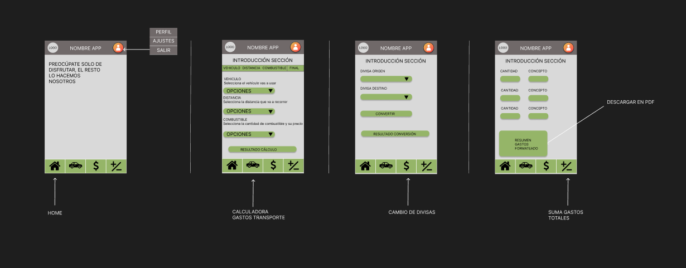

# Diseño

Las funciones que la aplicación deberá incluir para su buen funcionamiento son las siguientes:

- Barra de navegación con las secciones "Home", "Calculadora de Gastos de Transporte", "Conversión de Divisas" y "Calculadora de Gastos Totales".
- Toolbar con logo, nombre de la aplicación y un desplegable con opciones tales como "Perfil", "Ajustes" o "Salir".
- Calculadora de gastos de transporte en la que el usuario podrá, mediante la selección de varias opciones, calcular el coste aproximado de su trayecto.
- Cambio de divisas, con acceso a una API externa, en la que el usuario podrá seleccionar que divisa y en qué cantidad desea convertir.
- Pantalla con mapa del mundo.

## Navegación

Se adjuntará un esquema de mockup’s de las diferentes pantallas, la navegación y los datos intercambiados entre ellas.

